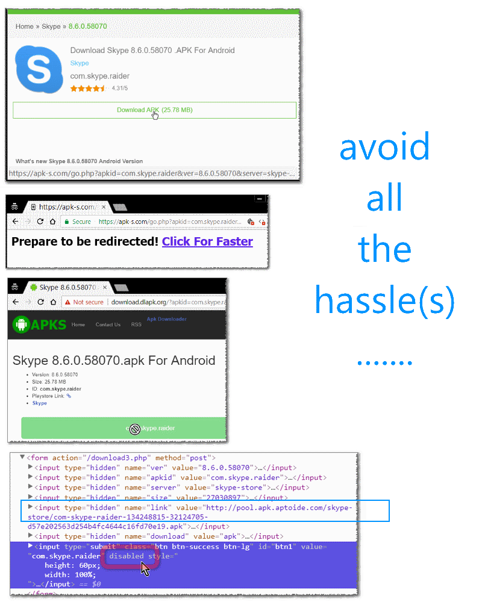
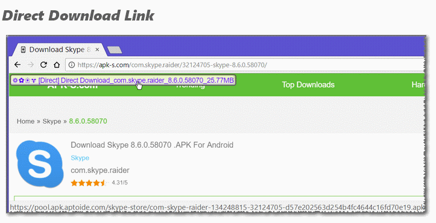

<h1> Chrome-Extension-APK-S-Direct</h1>

<h3>Skips links, buttons, forms and sub-pages, places an easy to find button, on top of the page.  Direct link, you can copy&amp;paste to a download-manager.</h3>

You can even disable JavaScript and cookies for <code>[*.]apk-s.com</code> and <code>[*.]dlapk.org</code> through <code>chrome://settings/content/javascript</code> and <code>chrome://settings/content/cookies</code>.

You can search the website (it does not need JavaScript nor cookies) by using <a href="https://apk-s.com/search/skype">apk-s.com/search/skype</a> (for example) - for space character uses <code>+</code>, for complex search use javascript's <code>escape<code>.
Alternatively use Google's <code>site:apk-s.com skype<code>,
for example: <a href="https://www.google.com/search?num=50&gbv=1&q=site%3Aapk-s.com+skype">https://www.google.com/search?num=50&gbv=1&q=site%3Afilehippo.com+skype</a>.

 

 

Ps. if you DO choose to disable JavaScript you may have reduced in-site navigation and information,
you can use <a href="https://apkpure.com/">apkpure.com</a> which has a slightly more clear documentation and design (but slower download-servers).

<h3>This Extension Is A Great Time-Saver!</h3>

<pre>
Developer's HUB / Changelog

3.0.0.1
+ initial
</pre>

<!--  -->
