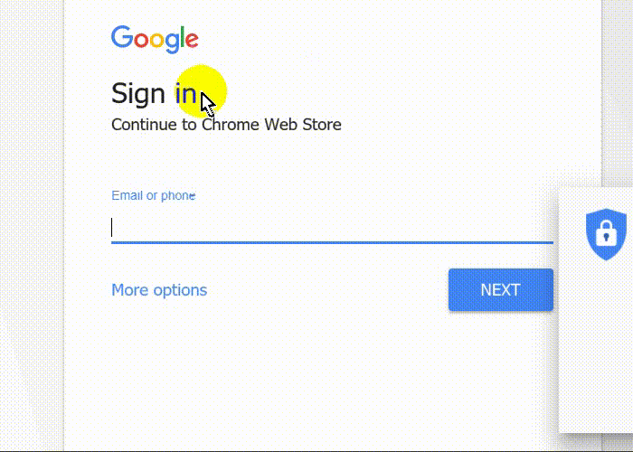

<h1> Chrome-Extension-AriaFix</h1>

<h2>★★★★★ Reduce Aria Improper Use, <strong>Fix It Too!</strong></h2>

Google uses an elaborate new password-input design,
it <em><strong>should</strong></em> be animated away when you're typing,
but due to bad design, it does not.

A generic example for non-appropriate use of aria-containers is
using an <code>aria-hidden</code> DIV container, 
as a <code>placeholder</code> for an input element,
it relays heavily on JavaScript; and is consider extreamly bad practice,
A better alternative is to use the input-<code>placeholder</code> attribute.
 

<pre>
Developer's HUB / Changelog

1.0.2.4
* improved walked through engine (two fixes per walk through + count).

1.0.0.1
+ initial
</pre>

<!--  -->
