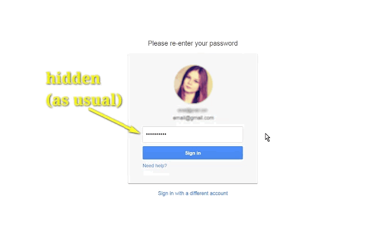
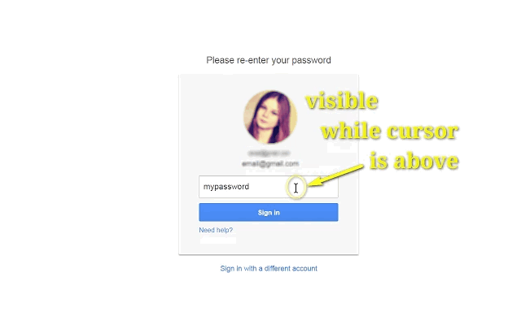
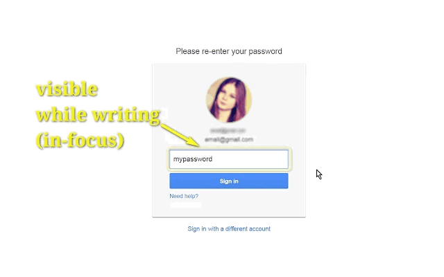

<h1> Chrome-Extension-Behind-The-Asterisks</h1>

<h2>Reveal What Is Behind The Asterisks Of A Password On Mouse Hover.</h2>

<h3>Ever mistype a password, and were had to delete all the characters- and wrote the whole thing again?</h3>

I think hiding a password behind "*" on YOUR OWN PC is rather pointless.

so I've wrote this Chrome extension to help me copy & paste, 
or edit long passwords very easily,

and once you move your mouse-cursor away, it's hidden again!
Easy!

Behind-The-Asterisks is 100% free (as beer..), include no ads (I hate those!), does NOT collect any data, include NO analytics, works entirely offline,
- and completely open-source.

You can view it here:
https://github.com/eladkarako/Chrome-Extension-Behind-The-Asterisks

Or even report an issue:
https://github.com/eladkarako/Chrome-Extension-Behind-The-Asterisks/issues

<pre>
Developer's HUB / Changelog

4.0.2.4
* using compatible event handler (non-passive).

4.0.2.1
+ added support for Chrome's idle state.
- reduce package size.
- limit re-discovery to once per-page life-cycle state-change (load/ready).

4.0.1.9
* fix engine-loading.

4.0.1.8
+ error handling

4.0.1.7
* engine update with improved id-logic.

4.0.1.5
* extension description update with emoji.

4.0.1.3
+ error-handling.

4.0.1.2
* adding prototyping for browser compatibility.

4.0.1.1
* tag-number updated instead of overriding it.

4.0.0.2
* engine update.

4.0.0.1
* project architecture, support execution on pages with and without JavaScript support, no code-duplication using the scope of the chrome-extension.

3.0.2.2
* Execution start earlier, for heavy pages.

3.0.1.1
* Enhance code-engine.
+ HoverText to Behind-The-Asterisks (Same as my 'old' Firefox-Extension name.. :])

2.1.0.3
* store mouse-hover state as object-oriented attribute instead of HTML element-attribute.

2.1.0.1
- limit mouse enter/leave event, in-favor of in/over.
* always execute main action in friendly non-blocking way.

2.0.3.1
+ Initial (no up-versioning while I've developed it...)
</pre>

How Does It Works?
- Hover Your Mouse-Cursor Above Any Password-Fields, To See Its Text-Content.
- Easily Edit Any Password-Field Text-Content, Copy And Paste Fully Supported.
- As Soon You'll Move Away Your Mouse-Cursor Or When Done With The Editing And Focus Something Else On The Page,
  The Password Field Will Be Back In Its *** Or ••• Form.

<!--  -->