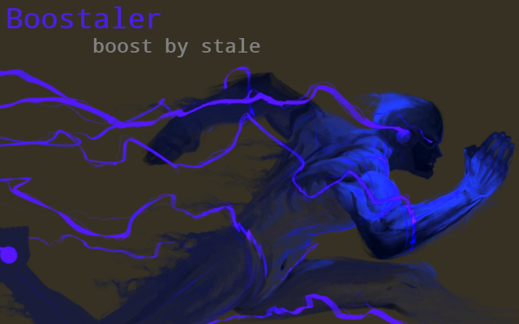

<h1> Chrome-Extension-Boostaler</h1>

<h2>Boost By Stale.</h2>
<h3>Please enable <code>chrome://flags/#enable-stale-while-revalidate</code> for the full effect.</h3>

Browse with astonishing speeds while all resources cached from last 24-hours are shown with almost 0-delay,
and any update is done in the background, if you visit same pages few times a day it will give you a huge-browsing speed-boost.

To see the full effect, please enable <code>chrome://flags/#enable-stale-while-revalidate</code> first, and restart the browser.

<h3>This Extension Is A Great Way To Enhance Browsing :)</h3>

<h3>Read about:</h3>
stale in <code>Cache-Control</code> header: <a href="https://tools.ietf.org/html/rfc5861">https://tools.ietf.org/html/rfc5861</a> (includes examples- but technical).

<pre>
Developer's HUB / Changelog

2.0.9.1
+ updating list-of-available, cache'able elements to Chrome's max value according to https://developer.chrome.com/extensions/webRequest , which adds media :]
* improving caching-system, enabling cache for everything (tryout...)

2.0.8.5
- prefer stale for resources only (not pages) to improve stability.
+ allowing stale on XHR to speed up dynamic pages (YouTube!).
* prefer using '--enable-stale-while-revalidate --enable-offline-load-stale-cache' command line switches to Chrome's-shortcut. The chrome-flag is removed on newer Chrome versions.

2.0.8.3
+ have stale directive on my request types (but not XHR ones!)

2.0.8.2
+ initial: (no versioning while was in-active alpha-stage :] ).
</pre>

<!--  -->