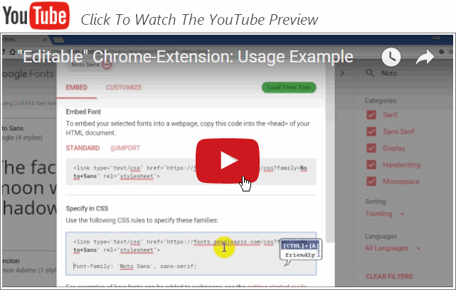
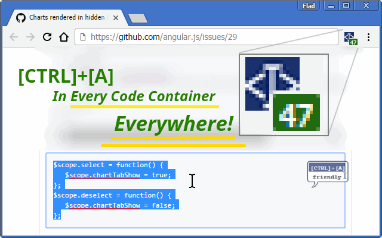
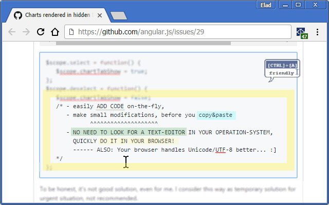
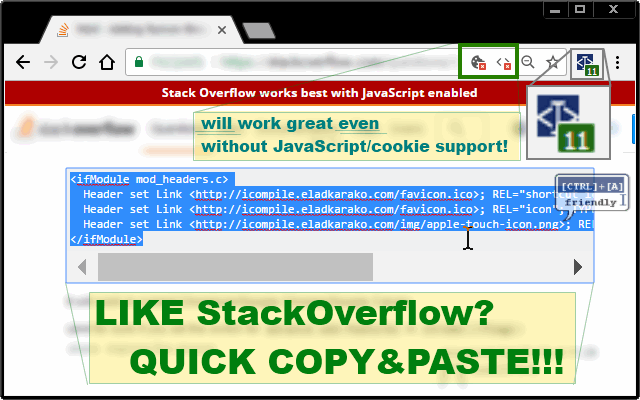
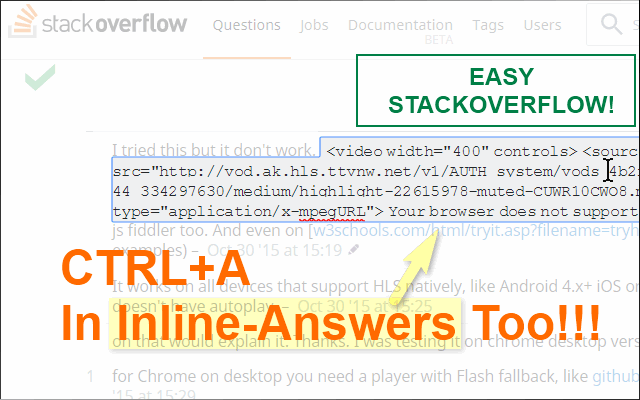
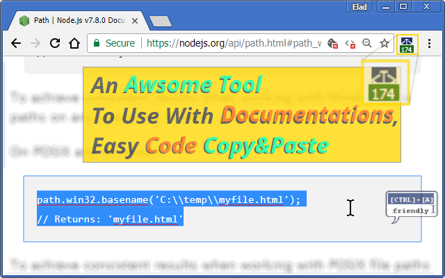
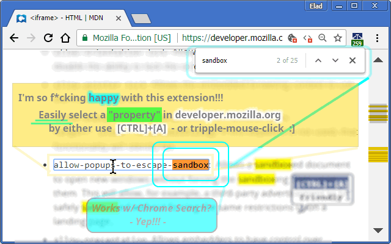
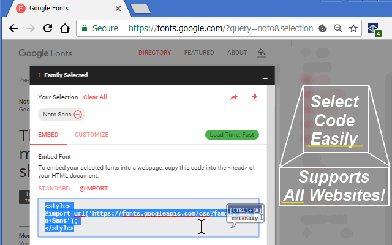
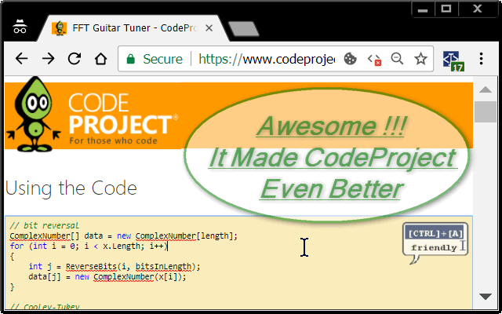
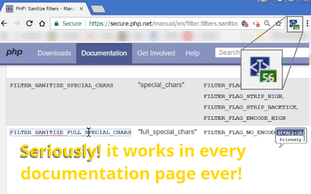

<h1> Chrome-Extension-Editable</h1>

Helps you to use CTRL+A in PRE and CODE elements.

You can even use them as mini-editor to save you time instead of copying them to another 3rd-party editor.
This is also makes especially easy to edit Unicode/UTF-8 content since browsers natively supports it.

<pre>
Developer's HUB / Changelog

8.0.1.3
* Google-translate easier copy of the result.

8.0.1.2
* adjustments for events used for dynamic content loading (pjax/offline rendering) used usually in GitHub's-framework, but will probably fit other websites too.

8.0.1.1
* code fix/cleanup.

8.0.0.9
+ adding github's danger-zone repository easy copy.

8.0.0.8
+ adding support for W3Schools code-segments, although it is a shitty website and you should always prefer Mozilla's website.
* improving query for new elements on dynamic pages with PJAX/SPF/generic.

8.0.0.4
+ adding support for github's last node path (file/folder name) at the file/folder browser.

8.0.0.3
+ adding support for last-node at the Breadcrumbs-crumb list of folders at googlesource.com for easy file-name copy.

8.0.0.2
+ adding support for googlesource.com (very useful since raw file links are not always available).

8.0.0.1
* simplified engine.

7.0.0.6
* better applying "you can select this" rule, ignoring PRE elements which are used for a container of clickable elements (links and such..).

7.0.0.5
* engine fix for missing filter-method.

7.0.0.4
* only handle elements without link(A) element inside (it makes links hard to click...)

7.0.0.3
* more efficient counter.

7.0.0.2
* migrate to using 'user-select' CSS instead of contentEditable. main js code just there for counting.

6.0.3.2
* improved engine.

6.0.3.1
* using an object-isolated structure.
+ killing nasty 'Crayon-Syntax-Highlighter', replacing it with plain PRE, with safely encoded text.

6.0.0.1
+ adding an additional code-recognise pattern, generic- used in pinvoke.net.
* versioning changed for better compatibility with future releases. :]

1.0.0.8
* fix engine-loading.

1.0.0.7
+ error handling

1.0.0.6
* improved elements-discovery query with more signatures for code-blocks.

1.0.0.5
+ initial
</pre>

<!--  -->