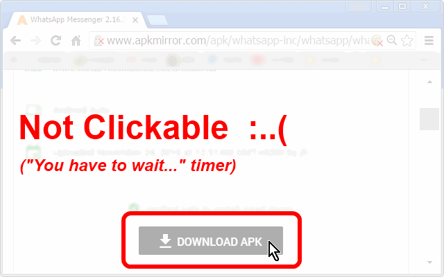

<h1> Chrome-Extension-Enabler</h1>

<h2>Immediately Enable Everything</h2>

👆︎ Enables disabled buttons.

👀︎ Reveals hidden content.

📖︎ Removes text selection limits.

👇︎ Enables touch gestures and scrolling everywhere.

👔︎ Zero configuration needed. Plug&Play.

🌼︎ 🌼︎ 🌼︎ 🌼︎ 🌼︎ 🌼︎ 🌼︎

💕︎ Free, no ads, no tracking, no analytics, no cookies. works 100% Offline, Open-source.

<h3>Especially useful on websites that include some-kind of "wait until you could click the button" timer,
(such as download websites) - well No more!</h3>

<h3>This Extension Is A HUGE Time-Saver!!!</h3>

<pre>
Developer's HUB / Changelog

3.0.2.8
+ handling "controlslist" to allow downloading media-elements.

3.0.2.7
* improved main content scroll behavior.

3.0.2.6
+ added support for Chrome's idle state.
- reduce package size.
- limit re-discovery to once per-page life-cycle state-change (load/ready).

3.0.2.5
* fix engine-loading.

3.0.2.4
+ error handling

3.0.2.3
* improved visibility rules to force display hidden html/body when hidden by abusive adblocking plugins and such..

3.0.2.1
* improved display rules to make sure page is always visible.

3.0.1.9
- removed the 'always allow scroll-bars' css-rule (although useful on some cases).

3.0.1.8
* engine update: allowing scrolling page's content (if needed), this helps to counter many (!) content-limitation used in modal and in-page pop-ups.

3.0.1.6
* engine fix, for repetition-flag

3.0.1.4
* limit repetition by flag done-elements.

3.0.1.3
+ error handling

3.0.1.2
* adding prototyping for browser compatibility.

3.0.1.1
* tag-number updated instead of overriding it.

3.0.0.5
+ Added awsome rule to always display the HTML/BODY, to counter some malicious websites blocking main content until some condition is met.. :/

3.0.0.1
* project architecture, support execution on pages with and without JavaScript support, no code-duplication using the scope of the chrome-extension.

2.0.1.8
* update CSS-Rules override for cursor (for other page life-cycle states).

2.0.1.7
- remove CSS-Rules override for cursor.

2.0.1.6
* engine cases error-handling.

2.0.1.5
- removing user-modified rules since it may override contentEditable attributes.

2.0.1.3
- removing inline-style matching and handling.
* Engine update with some more counter-CSS rules.

2.0.1.1
+ Engine update with some more counter-CSS rules.

1.0.0.5
+ initial.
</pre>

<!--  -->