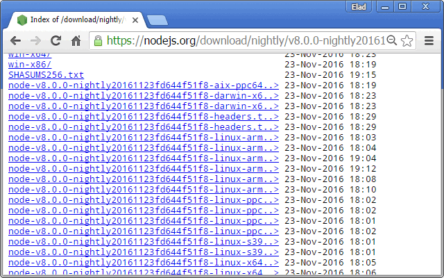
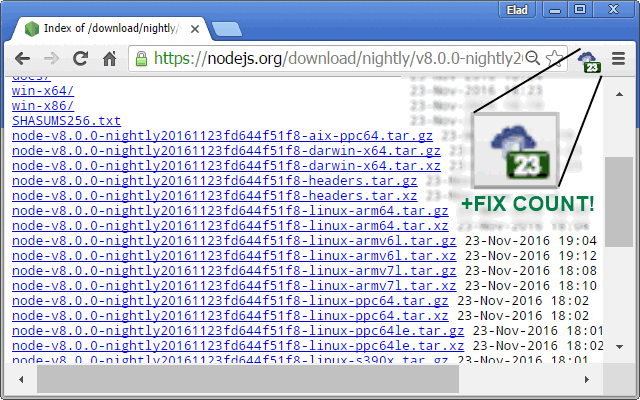
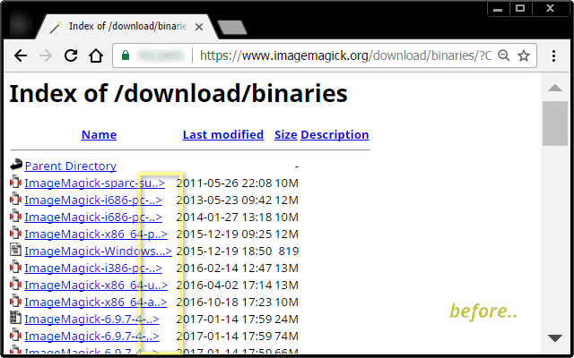
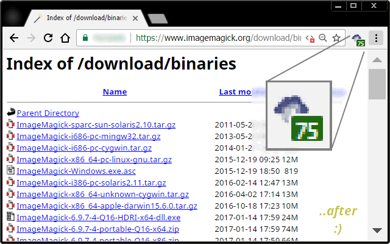

<h1> Chrome-Extension-FTP-Fix</h1>

<h2>★★★★★ Fix Stuff 🔧︎ In FTP-Like Download Pages.</h2>

Here are good example-pages to see how it works
 - <a href="https://nodejs.org/download/nightly/v8.0.0-nightly20161123fd644f51f8/" target="_blank">https://nodejs.org/download/nightly/v8.0.0-nightly20161123fd644f51f8/</a> (the NodeJS download page).
 - <a href="https://www.imagemagick.org/download/binaries/?C=M;O=D" target="_blank">https://www.imagemagick.org/download/binaries/?C=M;O=D</a> (the ImageMagik not magic! download page).

<h3>This Extension Is A Great Way To Enhance Browsing :)</h3>

<pre>
Developer's HUB / Changelog

3.0.2.3
+ dynamic page support.

3.0.2.1
+ added support for Chrome's idle state.
- reduce package size.
- limit re-discovery to once per-page life-cycle state-change (load/ready).

3.0.1.9
* fix engine-loading.

3.0.1.8
+ error handling

3.0.1.7
* description fix.

3.0.1.6
* fixed repetition-flag in elements-query.

3.0.1.4
* limit repetition by flag done-elements.

3.0.1.3
+ error handling

3.0.1.2
* adding prototyping for browser compatibility.

3.0.1.1
* tag-number updated instead of overriding it.

3.0.0.2
* project architecture, support execution on pages with and without JavaScript support, no code-duplication using the scope of the chrome-extension.

2.0.2.2
* engine upgraded with a heuristic algorithm to handle all websites.

1.0.0.1
+ initial: handling only [https://nodejs.org/download/*] pages as proof of concept.
</pre>

<!--  -->