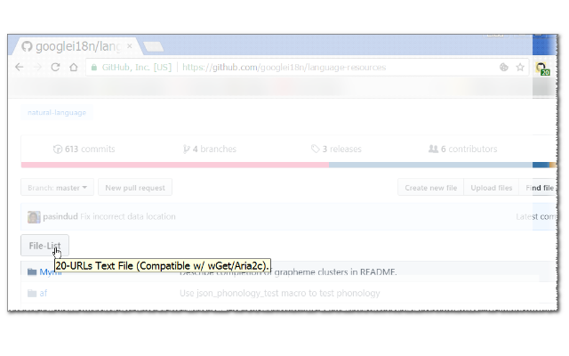

<h1> Chrome-Extension-GitHub-Download-List</h1>

<h3><em>★★★★★ Get You A Button To Download A List Of All Files The In-Page.</em></h3>

Will not play nice with GitHub's <code>JS-Navigation</code>,
But you can always install <a href="https://github.com/eladkarako/Chrome-Extension-History-API-Disabler/">History-API-Disabler</a> to fallback to normal-browsing.
<pre>
Developer's HUB / Changelog

1.0.0.2
+ initial (won't work nice with GitHub's version-of-SPF, user have to hard-refresh).
</pre>

 
<!--  -->