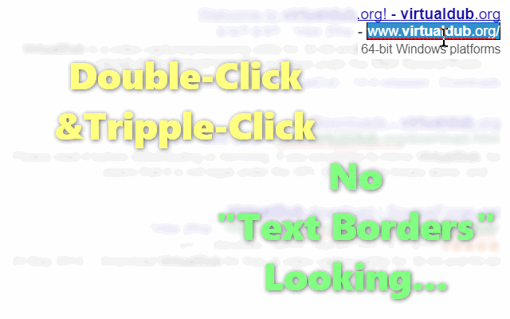
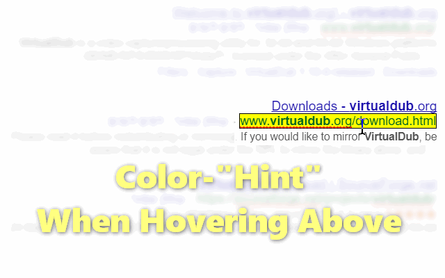

<h1> Chrome-Extension-Google-URL-Select</h1>

<h2>Easy Select/Copy Of Google-Search URLs</h2>

Done 100% With CSS,
No JavaScript - No Lags, No Slowness, GPU Assist.

 

<h3>This Extension Is A Great Way To Enhance Browsing :)</h3>

<pre>
Developer's HUB / Changelog

1.0.0.1
+ initial.
</pre>

<!--  -->