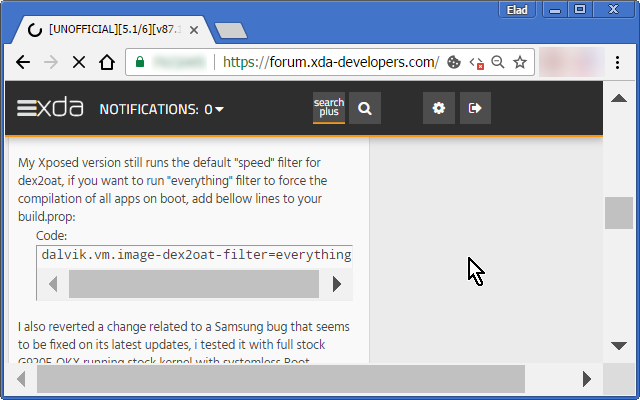

<h1> HTTPS-Fix</h1>

It looks for videos, iframes, images, css-links and other stuff,
on badly programmed pages, that loaded from HTTPS location, but still uses hard-coded HTTP prefix URLs,
Then it fixes the URL so it won't raise an error in your browser,
--- since the URL would have never had been loaded successfully anyway,
    in its original state, at least you have a chance of putting HTTPS as new prefix will fix the problem for you.

--- It can magically make websites work again!

<h3>This Extension Is A Great Work Enhancer!</h3>

<pre>
Developer's HUB / Changelog

1.0.0.1
+ initial
</pre>

<!--  -->
