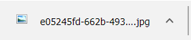

<h1> Chrome-Extension-Link-Decrypt</h1>

<ul>
<li>Google Has New Some For You: <strong><em>Encrypted Links</em><strong>, Which Chrome Blocks Download-Of.</li>
</ul>

<li>Chrome-Extension-Link-Decrypt Allows You To Download Everything, Freely.</li>
<li>Try It Now On Google Images.</li>
</ul>

 
 
 
 
 

 

<h2>Link-Decrypt Is A <strong>Huge Time-Saver!</strong></h2>

 

<pre>
Developer's HUB / Changelog

1.0.0.1
+ initial.
</pre>

<!--  -->