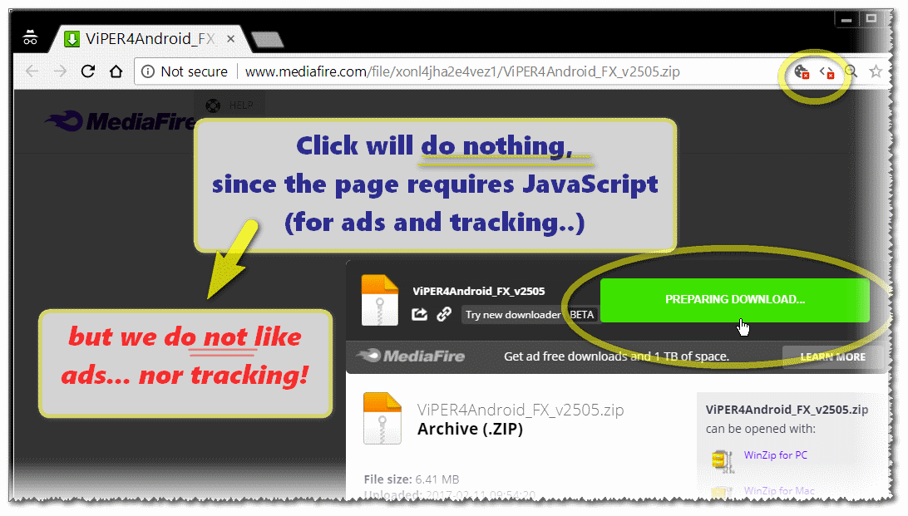
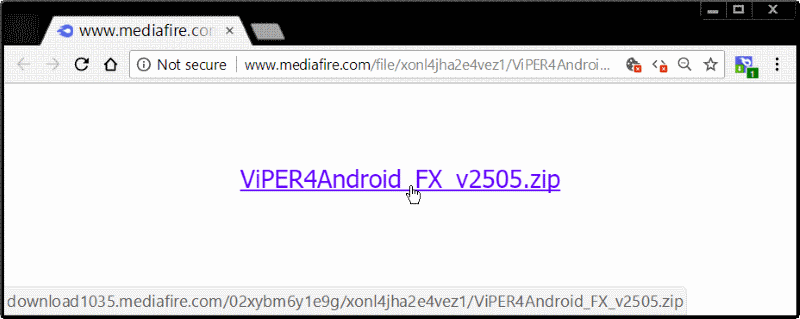

<h1> Chrome-Extension-MediaFire-Direct</h1>

★★★★★ Direct Download-Link In MediaFire.com ✔︎

 

 

You might as well block JavaScript and Cookies the Chrome-extension will still work,
and you can keep your privacy and avoid pop-ups and ads!

<pre>
Developer's HUB / Changelog

1.0.0.1
+ initial.
</pre>

<!--  -->