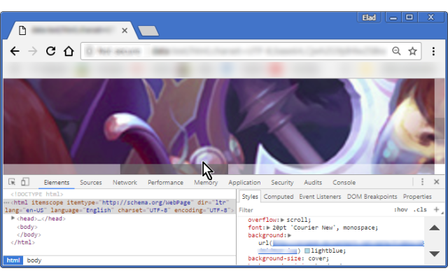

<h1> Chrome-Extension-Nice-Scrollbars</h1>

<h2>★★★★★ Professional Design. 👔︎</h2>

- Smooth And Minimal Design.

- <strong>See-Through The Scrollbars!</strong>
- Convenient Size And Visibility.
- Uses The Native Scrollbars. Super Fast, <strong>No JavaScript!</strong>
- <strong>React Better</strong> And Faster To Mouse-Wheel.
- Will <strong>Always Fit Well</strong>, Regardless How You Configure Your Browser's Font-Size And Zoom-Level.

- Zero Configurations Required.
- You Will Notice An Improvement Immediately (No Need To Restart The Browser).
- 100% Compatible with *every page*, In every page you'll feel (at least) a slightly improvement on responsiveness and overall experience.

<em>For Developers: <a href="http://icompile.eladkarako.com/nice-scrollbars/">http://icompile.eladkarako.com/nice-scrollbars/</a></em>

<h3>This Extension Is A Great Way To Enhance Browsing :)</h3>

<pre>
Developer's HUB / Changelog

1.0.1.1
+ semi-transparent border.
* improved handling existing styles.

1.0.0.3
+ initial.
</pre>

<!--  -->