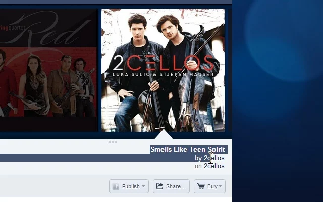
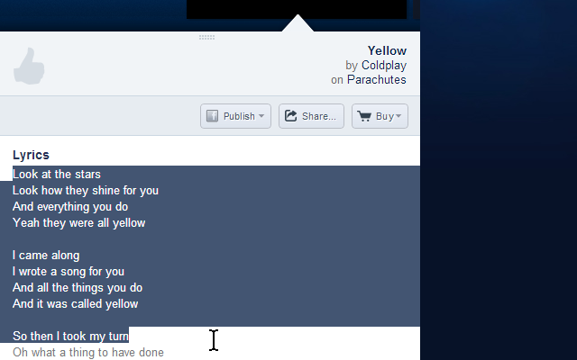
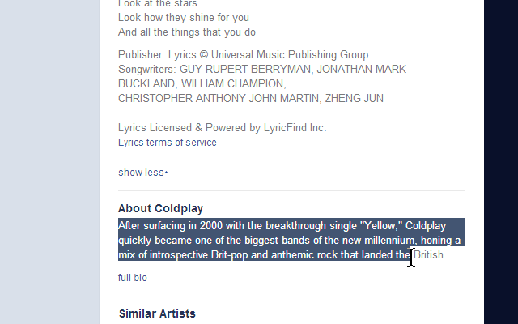

<h1> Chrome-Extension-Pandora-Text-Select-Enabler</h1>

<h2>Remove Text Protection, And Re-Enable Text Select/Copy Across The Whole Website.</h2>

<h3>This Extension Is A Great Way To Copy Your Favorite Lyrics, Or Use It If You Feel Like No-One Should Block Your Browser-Usability, Ever!</h3>

<pre>
Developer's HUB / Changelog

4.0.3.2
* engine-update: improved identification of inline-blocking styles.

4.0.2.3
- removing HTTP-headers modifications and unneeded permissions.

4.0.2.2
+ smart-removing Pandora's evil events from elements on the page.
* engine update: efficient handling page resources.
+ added "hard but gentle" CSS-rule-override for "unselectable" nodes (complementary to the JavaScript solutions :] ).
* engine update: make main action more-lazy by repeating it every 5sec instead of 2.5sec.

4.0.2.1
* engine update handling HTTP-req./resp. related resources only for Pandora-domains.

4.0.1.2
* overall graphics update.

4.0.1.1
+ initial (no versioning while product was in-alpha developing :/ ).
</pre>

<!--  -->