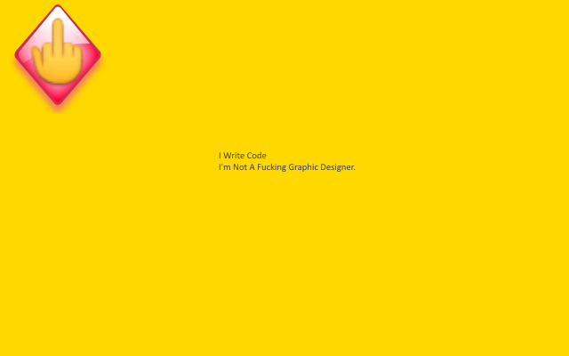

<h1> Chrome-Extension-Popup-🖕</h1>

You = Safe. Pop-Ups = 🖕︎!

<pre>
Developer's HUB / Changelog

1.0.4.8
+ excluding youtube since its new UI uses global listeners.

1.0.4.7
+ excluding *.eBay.* hostname since it uses document.write and eval (in review pages).
* adding some other descriptions/reorder exception-rules (readability).

1.0.4.6
* ignore-rules: ignore on github.com domain, since github.com uses listeners for menues.

1.0.4.5
+ double the effort of blocking bad-objects- in additional to deleting the object reference itself, try to delete actual objects (by its reference).
* workaround early-loading-stage (before body) empty script-injection by using innerHTML instead of text-node-child to set the injector content.

1.0.4.2
+ adding some do-not-track directives, that some websites respect..

1.0.3.1
+ allow local-network since routers web-software uses eval :(

1.0.2.3
+ allow godaddy websites

1.0.2.1
+ disables HTML5 history-api, to make browsers fallback into normal browsing.

1.0.1.1
+ why block some evil things

1.0.0.7
+ exclude my domains and Google domains (did you know that gmail uses document.write ... :/ )

1.0.0.5
+ initial.
</pre>

<!--  -->