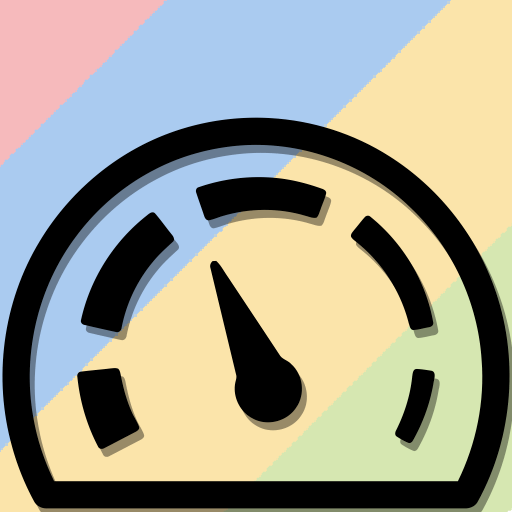

<h1>chrome_extensions</h1>
 <a href="012MobileLoader/"             > 012MobileLoader</a>
 <a href="AndroidFileHost-Fix/"         > AndroidFileHost-Fix</a>
 <a href="APK-S-Direct/"                > APK-S-Direct</a>
 <a href="AriaFix/"                     > AriaFix</a>
 <a href="AutoComplete-Enabler/"        > AutoComplete-Enabler</a>
 <a href="Behind-The-Asterisks/"        > Behind-The-Asterisks</a>
 <a href="Boostaler/"                   > Boostaler</a>
 <a href="CORS/"                        > CORS</a>
 <a href="CSS-Image/"                   > CSS-Image</a>
 <a href="eBay-Boxed/"                  > eBay-Boxed</a>
 <a href="eBay-Top-Pagination/"         > eBay-Top-Pagination</a>
 <a href="Editable/"                    > Editable</a>
 <a href="Ellipsis-Fix/"                > Ellipsis-Fix</a>
 <a href="Enabler/"                     > Enabler</a>
 <a href="FileHippo-Direct/"            > FileHippo-Direct</a>
 <a href="FTP-Fix/"                     > FTP-Fix</a>
 <a href="GitHub-Download-List/"        > GitHub-Download-List</a>
 <a href="Google-URL-Select/"           > Google-URL-Select</a>
 <a href="History-API-Disabler/"        > History-API-Disabler</a>
 <a href="HTTPS-Fix/"                   > HTTPS-Fix</a>
 <a href="Link-Decrypt/"                > Link-Decrypt</a>
 <a href="Meta-Refresh-Killer/"         > Meta-Refresh-Killer</a>
 <a href="MirrorX/"                     > MirrorX</a>
 <a href="Nice-Scrollbars/"             > Nice-Scrollbars</a>
 <a href="Nothing/"                     > Nothing</a>
 <a href="Noto/"                        > Noto</a>
 <a href="Pandora-Text-Select-Enabler/" > Pandora-Text-Select-Enabler</a>
 <a href="PopUpsFU/"                    > PopUpsFU</a>
 <a href="Real-URL/"                    > Real-URL</a>
 <a href="Redundant-Click/"             > Redundant-Click</a>
 <a href="Remove-Redirects/"            > Remove-Redirects</a>
 <a href="Socket-Killer/"               > Socket-Killer</a>
 <a href="SourceForge-Direct/"          > SourceForge-Direct</a>
 <a href="Speedy-Rendering/"            > Speedy-Rendering</a>
 <a href="SpellCheck-Enabler/"          > SpellCheck-Enabler</a>
 <a href="SPF-Disabler/"                > SPF-Disabler</a>
 <a href="Tahoma-CourierNew/"           > Tahoma-CourierNew</a>
 <a href="Unicode/"                     > Unicode</a>
 <a href="UnLazy/"                      > UnLazy</a>
 <a href="Unsecure/"                    > Unsecure</a>
 <a href="UserAgent/"                   > UserAgent</a>
 <a href="XDA/"                         > XDA</a>
