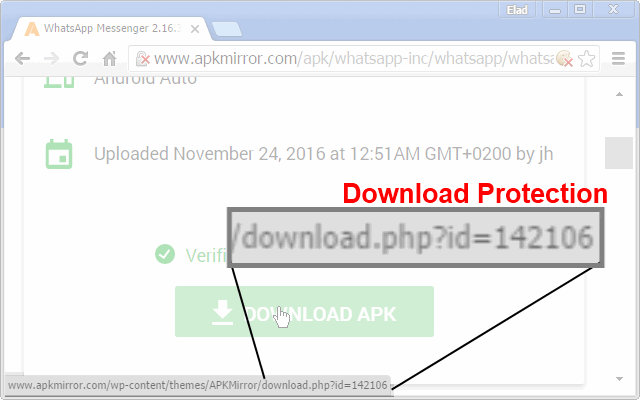
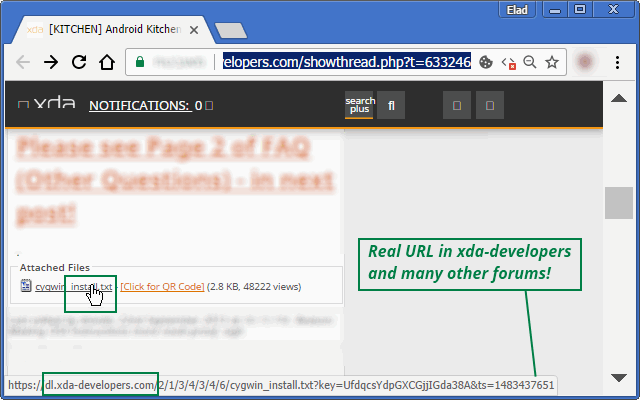

<h1> Chrome-Extension-Real-URL</h1>

<h2>Real-URL rewrites the links on the current page you are watching,
stripping-away download-protections, and getting you the direct-download link.</h2>

It makes your browsing experience more secure, by allowing you to see
what is the real target of the link, without actually following it,

This also means you save yourself ads, click-baits any many malicious-contents.

It help you save time, by skipping waiting-screens and download-pages,

You can even copy the real-URL into a multi-part download-managers,
such as FlashGet, JDownloader, Orbit-Downloader or aria2c to download in a much faster-speeds than you were intended to.

More Speed Bonus!
The Real-URL extension follow all of the 301/302 redirect-chains,
It also resolve URLs, so when you'll be finally click the link,
You skip all DNS-resolving, go ahead directly to the final target.

Currently handles:
- All WordPress based-on websites. [for example: APKMirror.com]

<h3>This Extension Is A HUGE Time-Saver!!!</h3>

<pre>
Developer's HUB / Changelog

2.0.7.7
* code-refactor.

2.0.7.5
* improved engine.
+ added support for Chrome's idle state.
- reduce package size.
- limit re-discovery to once per-page life-cycle state-change (load/ready).

2.0.7.2
+ also resolve refresh-tags :]

2.0.6.9
* adding some PHP-redirect resolving, that required fetching of the target (works great with with "remove-redirect" extension: https://github.com/eladkarako/Chrome-Extension-Remove-Redirects/)

2.0.6.8
* fix engine-loading.

2.0.6.7
+ error handling

2.0.6.5
* engine update - improve discovery query.

2.0.6.4
+ error handling

2.0.6.2
* adding prototyping for browser compatibility.

2.0.6.1
* tag-number updated instead of overriding it.

2.0.5.3
+ adding handling of attachment-links, this will show the real-links in many(!) bb-forums (such as xda-developers forums).

2.0.4.1
* back to WordPress-like pages only, as an operation-limiter.

2.0.3.3
+ add request-status to element's info-attributes.

2.0.3.1
* only handle https-to-https and http-to-https/http, query it in early-stage in the code, which is a more efficient way then later-filtering.
+ quite error-handling of open/send (to support early blocking in AdBlock/uBlock extensions sending 40* to hard-block nasty urls ;] )

2.0.1.1
+ enhanced security, play safe on SSL and different-domains.

2.0.0.1
* project architecture, support execution on pages with and without JavaScript support, no code-duplication using the scope of the chrome-extension.

1.0.0.8
+ resolve all links, not just WordPress. resolve 30* codes and update the REAL url directly into the page.

1.0.0.5
+ initial
</pre>

<!--  -->