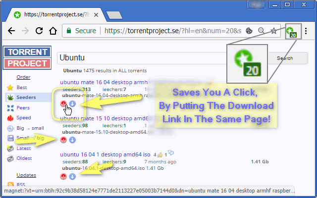

<h1> Chrome-Extension-Redundant-Click</h1>

Save you a click by bringing the download links to the current page,
currently works on <code>torrentproject.se</code>

##This Extension Is A Great Time-Saver!

<pre>
Developer's HUB / Changelog

1.0.0.7
+ added support for Chrome's idle state.
- reduce package size.
- limit re-discovery to once per-page life-cycle state-change (load/ready).

1.0.0.4
+ handling non-existing download-links.

1.0.0.3
* fix engine-loading.

1.0.0.2
+ error handling

1.0.0.1
+ initial
</pre>

<!--  -->