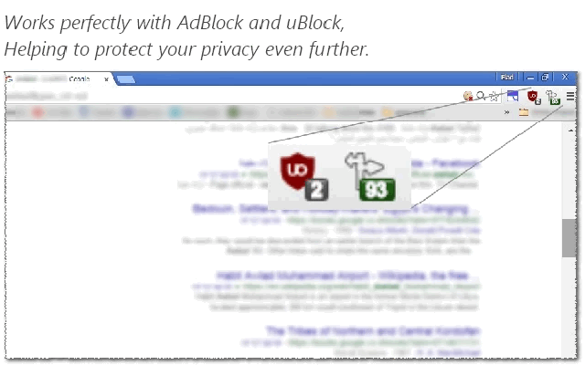

<h1> Chrome-Extension-Remove-Redirects</h1>

<h2>A Complementary Chrome-Extension For <a href="https://chrome.google.com/webstore/detail/cjpalhdlnbpafiamejdnhcphjbkeiagm">uBlock Origin</a> and <a href="https://chrome.google.com/webstore/detail/gighmmpiobklfepjocnamgkkbiglidom">AdBlock</a></h2>

<h4>Remove Redirects, That Are Hidden in OnMouseDown Events And That Are Modifying The HREF Property On-The-Fly. Common In All Of Google-Search, Outbrain And Taboola Crappy Recommendations, The Extension Also Tells You How-Much Redirects Were Hidden In The Page And Were Removed :]</h4>

<h3>This Extension Is A Great Way To Protect Your Privacy.</h3>

<pre>
Developer's HUB / Changelog

1.9.8.8
+ remove click tracking at nana10.co.il

1.9.8.7
+ adding reddit first-layer redirect links (second layer is a BASE64-JSON but it carries other info so I will keep it for now...)

1.9.8.5
* improving engine, reducing code.

1.9.8.1
* rewrote the discovery query string.
* improved the safe-redirecturl fixing.

1.9.7.7
* improved background-counter-system's efficiency.

1.9.7.6
+ Added support Chrome's idle state.
* increase engine efficiency.
- reduced the running of the major fixes to three times, on page's life-cycle load/ready.
* reduced package size.

1.9.7.5
* improved engine.
+ accurate fix value, not just per identified item, but after a fix-has applied.
+ adding CURE for Facebook redirect links (requested by the user "Messiah Mews" :] )

1.9.7.3
* added more Google remove-redirects.

1.9.4.9
* don't handle gmail's safe-links.
* multi-line comment refactoring to single line.

1.9.4.8
+ added heuristics/patterns for real-url, hinted in the text-content. since it is very risky it is for now only limited to t.co/ links in twitter.com domains.

1.9.4.7
+ more patterns for twitter-links heuristics :]

1.9.4.5
* improved fixing of protocol-less urls in data-url attributes.

1.9.4.4
* improved uneascape leftovers.

1.9.4.3
+ added support for more instagram links.

1.9.4.1
+ handling Google picture-redirects redirects, but only clicks, never resource-loading, since Google loads resources through safe HTTPS proxy, which is better- but I CAN FIX "click links".

1.9.3.3
* improved loading.

1.9.3.2
+ error handling

1.9.3.1
* improved pattern, to accurately identify and remove generic php-redirect plugin.
+ clean page from behavioural tracking! yeahiiiiii!

1.9.2.7
* added more Google redirects, using 'data-saferedirecturl', I might be reverting this one since it is used in gmail, and might actually be a valid way of protection, but then again so is proper antivirus, using opendns/google-dns and applying common-sense, so google do not have a valid point, ..really.. of modifying links in one's emails' body..

1.9.2.5
* engine improve query: ignore invalid elements with href that is not a real-url (such as onces starting with 'javascript:').

1.9.2.3
+ get disqus direct links.
* engine updates: specific target only 'A' elements ignoring other elements with href attributes.
* typo fix: handle correct cloned elements on the bonus unhook events part.
* engine improve query, shorten repeating part putting it in a 'glue' variable.
* engine update: flag rename from 'done-remove-redirects' to 'done-removeredirects' convention.
* engine update: always use flag 'done-removeredirects', which makes sure element handled once, only new elements rediscovered (which means javascript re-modified elements might not re-cured.. :/ but it will make the overall engine quicker to discover only new stuff!!).

1.9.1.6
* engine update - improve discovery.

1.9.1.5
+ error handling

1.9.1.3
* adding prototyping for browser compatibility.

1.9.1.2
* tag-number updated instead of overriding it.

1.9.0.2
* operation-flag renamed.

1.9.0.1
+ rebrand.

1.8.0.1
* project architecture, support execution on pages with and without JavaScript support, no code-duplication using the scope of the chrome-extension.

1.7.0.1
* engine upgrade, early start even before all text-content written (for large pages). including improved heuristics on every rule, especially for pages with no-javascript, and asynchronous code-block execution after DOM-nodes modifications.

1.6.0.8
* updating identification rules for twitter links, to a wider match, include a fix for URLs with a missing protocol.

1.6.0.7
* engine update: improving identifying elements with invalid-href attribute.

1.6.0.6
+ engine upgrade: replace short-links in instagram and twitter ("t.co/...") with real-links!

1.5.5.1
+ handling static Google-redirect-url ("/url?q=...[real URL here]...&...") used (usually)
  on pages without JavaScript.
* project structure change, providing overall performances improvement.

1.5.4.5
+ adding another nasty way some websites changes the URL by directly modifying window.location.

1.5.4.3
* modify structure, improving the window/self isolation, since the algorithm runs in
  each frame in the page, thus addressing only a specific global-scope.
* improving overall algorithm speed, by running DOM-heavy-operations on synchronously-pool.

1.5.3.1
- removing project load on idle state (window.load) in favor of end state (DOMContentLoaded) 
+ adding repeat fix, for pesky websites that overwrite the fix :]

1.4.3.1
- removing handling the request-headers at all(!)
  Since Google-Chrome only allows a single-extension to handle each header(s),
  trying to modify a request-header that has changed by another extension will either break
  this or the other extension.
- (as a result) removing some extension permissions, now unneeded.
- (as a result) removing some project resources, now unneeded.
* project load state: repeating the fix, on page's loading-states, for dynamic websites.

1.4.2.1
* updating main-query's efficiency, targeting link-like elements,
  with 'href' attributes only, to avoid div with 'window.open' actions.
+ try/catch to avoid errors when user close a tab midpoint loading, on header-modification phase.
+ handling "Google-Images", providing direct access to either original page or original image,
  this significantly accelerating the entire Google-Images page! hurrah!

1.4.1.3
* updating main-query, to handle common cases where 
  'window.open' overrides default click (click jacking),
  protecting against pop-up in many malicious websites.

1.3.1.1
- removing permissions: declarativeWebRequest, gcm, activeTab,
  experimental, webNavigation, nativeMessaging, 
  used by my extension-template.
* update conditions, to handle pages where elements were 
  placed in improper locations (for example not BODY)

1.3.0.2
* updated GitHub project URL.

1.3.0.1
+ basic Google-Search redirect events cleanup.
+ header modification to allow running cleanup on every page.
</pre>

<!--  -->