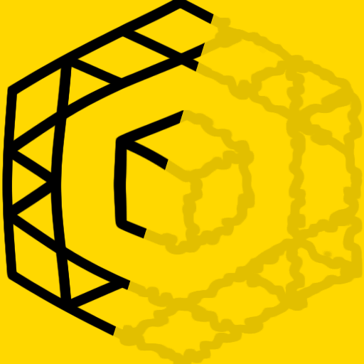

<h1> Chrome-Extension-SPF-Disabler</h1>

<h3><em>★★★★★ Back To Standard Browsing! ꗷ︎</em></h3>

Disabling the SPF engine is quite easy,
all you have to do it add <code>/spf.js</code> to your uBlock-origin adblock-list...

read more about it in here: <a href="http://icompile.eladkarako.com/disable-youtube-spf/"><em>iCompile -</em> Disable YouTube SPF</a>

<h3>But <strong>DON'T!</strong></h3>

many Google based websites do not have a proper fallback to standard-browsing anymore,
leaving you with much of the functionality missing,

Don't belive me?
Try YouTube with uBlock-origin and the custom rule: <code>/spf.js</code>.
Most of the menus will not respond well, and video-transitions in playlist will but unusable.

This is YouTube was not properly coded with a fallback in-case the JavaScript of SPF will be disabled, but the other functionality will kept enabled. So it is best to <strong>keep loading <code>/spf.js</code></strong>, but providing a workaround that will limit the usability of the loading-engine,

Effectivly giving you a <strong>SPF-Free</strong> website, without breaking anything.

<h3><em>SPF-Disabler</em> provides several solutions working heuristically side-by-side, Bringing you back the standard-browsing experience.</h3>

<pre>
Developer's HUB / Changelog

1.2.2.3
* improved script injection on early page-loading stages (no body).

1.2.1.1
+ inject fixing script to DOM, for specific window-SPF-like objects (heuristic) as queried from extension-context-scope.
* accurate counter update per needed objects.
* execute code in blocking code-block, rendering will halt until exeuted. Good thing, more secure.

1.0.9.1
- fork-out (ha!) History-API-Disabler chrome-extension
* reduce code, making SPF-like object discovery dynamic both in extension-scope and in page-scope injection.

1.0.8.1
+ disables HTML5 history-api so websites will fallback to normal browsing.

1.0.7.1
* does an improve discovery for SPF objects on the page, without actually pre-knowning their name. Will help discovery custom-SPF-products such as "ytspf" (youtube's SPF product) and will make the discovery code more heuristic and less hard-coded ;)

1.0.6.1
+ detaching some of the code to be ran from pure-DOM scope, override protection/isolations.

1.0.5.1
+adding support 'history-error-callback' in additional for 'navigate-part-received-callback' which is no-longer available for newer versios of SPF.js
+listening to window/document SPF events (done/partdone are useful the rest are heuristics)

1.0.4.1
+ improved counting and updating description of fixes in the badge-icon.

1.0.3.2
* only apply the SPF-limit fix if there is a evidence of SPF configuration object in the DOM.

1.0.3.1
+ initial (no versioning while product was in-alpha developing :| ).
</pre>

 

<!--  -->