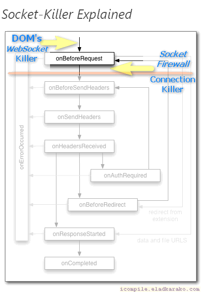

<h1> Chrome-Extension-Socket-Killer</h1>

<h2>Socket HEADSHOT!</h2>

<h4>The Ultimate Tool To Fight Against <code>WebSocket</code>s.</h4>

<ul>
<li><h3>100% Web-Socket Blocking!</h3></li>
<li><h3>Safe! All Websites Simply Use The Standard Connection.</h3></li>
<li><h3>Just Works! No Configurations Needed.</h3></li>
</ul>

<h3><strong>How?</strong> <em>(Technical)</em></h3>

<ol>
<li><h4><code>at_document_start.js</code> -&gt; <code>at_document_end.js</code> -&gt; <code>at_document_idle.js</code> action: Prevents DOM Usage Of <code>WebSocket</code> Object Constructor, by null'ifying it on initial-load, DOM-load complete and Window load stages.</h4></li>
<li><h4>The Manifest Attribute <code>"all_frames": true</code> Will <em>Also</em> Run [1] (Above) On Main Page, But <strong>Also</strong> On Every Sub-Frame! This Will Help You Combat Various IFRAME-Slaves Used By Various Companies (Google, eBay,..) - <strong>There Is No Sneaking Pass It</strong>.</h4></li>
<li><h4><code>background_request_manipulation.js</code> Will <em>Safely</em> Provides An Extra Protection-Layer, It Will Inspect <em>Socket Connection</em>, Both By Blocking Regular And <strong>Background/Hidden</strong> Connections Using The <code>ws://</code> Or <code>wss://</code> Schemes <strong>And</strong> By Explicitly Blocking The <code>websocket</code> Connection-Type For All URLs. This Will Stop Every Socket-Connection Even <strong>Before It Gets To Connect!</strong></h4></li>
<li><h4>[3] (Above) Will Stop Connections From Plugins Too! Ultimate Protection!</h4></li>
</ol>

<pre>
Developer's HUB / Changelog

1.0.2.5
+ adding action-counter in icon-badge.

1.0.2.4
* improving injected-script by applying its content with innerHTML to workaround text-nodes are unavailable in early page-loading stages.

1.0.2.1
* improved DOM script-injection with blocking mode for making sure it will effect from the very start.

1.0.1.5
+ error handling with tab closing too fast.

1.0.1.4
+ added support for Chrome's idle state.
- reduce package size.
- limit re-discovery to once per-page life-cycle state-change (load/ready).

1.0.1.3
* improved method applying mode.

1.0.1.2
+ null'ify the DOM's WebSocket Object.

1.0.0.1
+ initial.
</pre>

<!--  -->