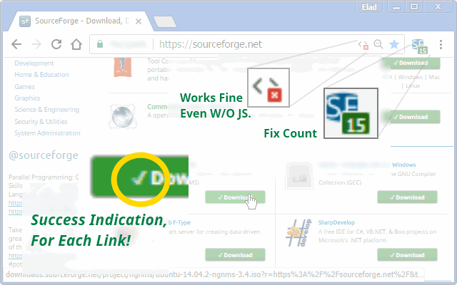
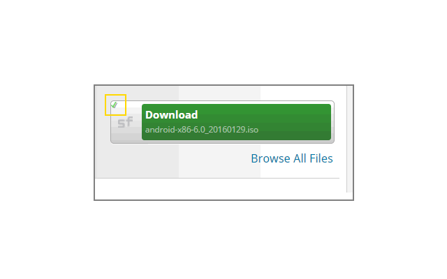
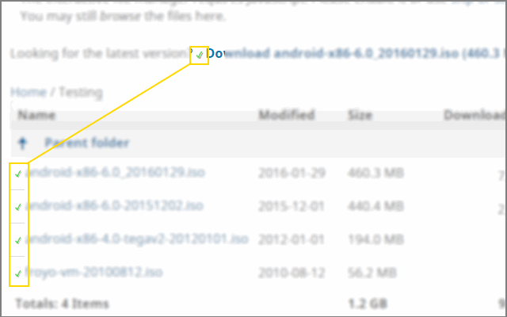
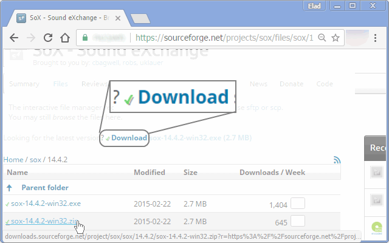
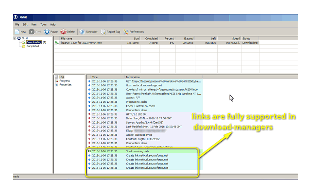

<h1> Chrome-Extension-SourceForge-Direct-Download</h1>

Download files directly, with no passing-through the waiting page,
all download-links on the page will be rewritten to the download-file,
you can click, right click "save target as" or copy-and-paste to a your favorite download-manager,

You both "save a click" and waiting time.

This extension is, also, friendly to SourceForge too (and you of-course..),
since it will you whatever download-mirror either you, (or SourceForge set for you) to download.

##This Extension Is A Great Time-Saver!

<pre>
Developer's HUB / Changelog

2.0.3.3
* improved result by resolving 302-redirects (from "waiting-screen") to final target URL.

2.0.2.4
+ added support for Chrome's idle state.
- reduce package size.
- limit re-discovery to once per-page life-cycle state-change (load/ready).
+ counter updates on real-fix.

2.0.2.1
* fix engine-loading.

2.0.1.9
+ error handling

2.0.1.8
* button links style fix.

2.0.1.4
+ error handling

2.0.1.2
* adding prototyping for browser compatibility.

2.0.1.1
* tag-number updated instead of overriding it.

2.0.0.5
* improving the 'v' mark visibility on white-backgrounds.

2.0.0.3
* successfull indication using a little 'v' mark.

2.0.0.1
* project architecture, support execution on pages with and without JavaScript support, no code-duplication using the scope of the chrome-extension.

1.0.1.1
+ indication of a success action on the link.
* engine executes early-on page's life cycle, and works faster.

1.0.0.6
+ more pre rewrite-links conditionals
+ repeating parsing in 5 seconds interval after DOM-write complete.

1.0.0.3
+ initial
</pre>

<!--  -->