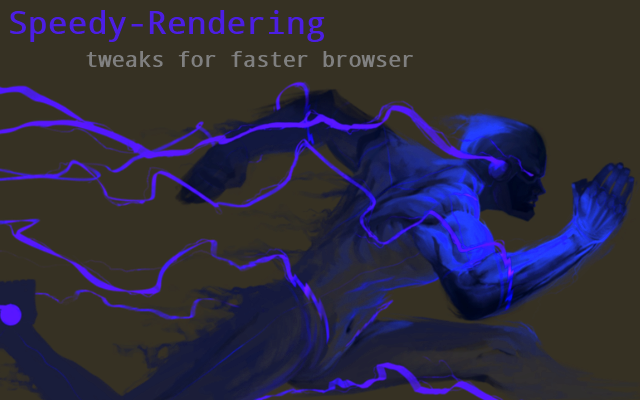

<h1> Chrome-Extension-Speedy-Rendering</h1>

<h2>Faster Rendering, Like A Summer Breeze.</h2>

- Page shows faster.
- Tabs will consume less RAM.
- Scroll, touch and movements such as drag&drop are more responsive.
- Composition layers, canvas and videos will show less lags, all rich HTML5 elements will behave better.
- In general pages _WILL JUST_ *respond better and feels faster*.

Rendering the page's content (text and graphic) is a hard-job for your browser,
This extension will make your browser smarter and will allow some enhancements,

- Zero Configurations Reuqired.
- You Will Notice An Improvement Immediately (No Need To Restart The Browser).
- 100% Compatible with *every page*, In every page you'll feel (at least) a slightly improvement on responsiveness and overall experience.

<h3>This Extension Is A Great Way To Enhance Browsing :)</h3>

Known issues, or more like an undesired side-effects
- You will loose some of the more advanced-features of the font-face, including some character-replacing or "connecting" (Arabic/Hindu  characters, for example, will be less stylish), but it is a more of a style-issue.
- Google's I'm not a robot will be shown wider due to breaking of the content over more-lines than usual (it uses iframe with content aligned in a weird way).
- Faster rendering means that the anti-aliasing will be less effective, so characters will seem more thin (but also more clear than usual).

<pre>
Developer's HUB / Changelog

2.0.3.5
- removed normalizer code, favoring overriding anyway...
+ adding another prefix (to make thing generic for copy paste, really just for me...)
- removing zoom from touch-action, to make it compatible with older browsers too (just "pan-x pan-y")...

2.0.3.4
* keeping the gentle-inheritance-rule, but modifying the from HTML to * again, to specificall address every element (but w/o ::before/::after yet).
* adding !important override for every stage start/ready/load again.

2.0.3.3
+ adding same rules at ready/load stages again.

2.0.3.2
* limiting CSS rule injection to documents initial state.

2.0.3.1
+ non-block font-loading with swap when ready, for faster first-print event (pure CSS!).

2.0.2.1
* putting all rules on HTML and making everything-else inherit from it instead of putting massive amount of ""different"" (really the same..) rules on each node. reduce CPU even more.
+ quicker rendering of page, due to removing all advanced-font-typographics from the font.
+ disabling font-smoothing, smooth-scrolling and 300ms for mobile-capable devices now makes more sense.
+ loading everything to load even before document wrote anything, allowing better compability (page can override stuff more easily!)

2.0.1.2
* improve scrolling reactiveness.

2.0.1.1
+ removing 300ms click/touch delay. No JavaScript required!
* minimized added rules to DOM-ready only.

2.0.0.2
* engine update through all stages of page's life-cycle.

1.0.0.5
* addressing all items in the page.
+ overriding text-shadow definition to unset.

1.0.0.3
+ unsetting text-shadow rules to speed up rendering even more (might change look slightly!);

1.0.0.1
+ initial.
</pre>

<!--  -->