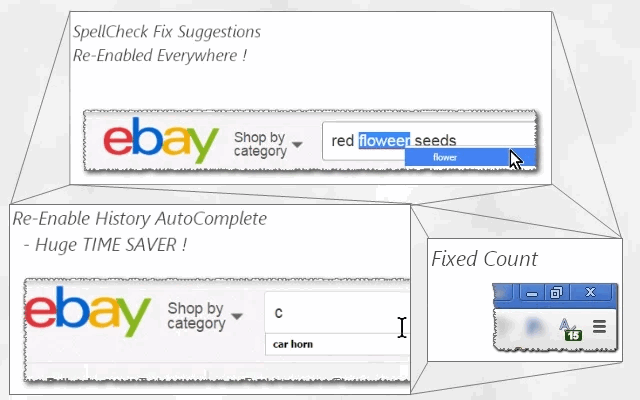

<h1> Chrome-Extension-SpellCheck-AutoComplete-Enabler</h1>

- Chrome Spell-Check Is Great! �︎
- Chrome Auto-Completing Is A Huge Time-Saver! �︎

- ❓︎  So Why There Are Websites That Disable Those Wonderful Features?
- ❗︎  Don't Know, Don't Care!

�︎
- Install This Extension, SpellCheck && AutoComplete Will Be Back!
- Works Perfectly With Every Website. 100% Compatible.
- Also Tells You How-Many \*Stuff\* Were Fixed  :]

�︎
After Installation, User-Experience Of A Lot Of Websites Will Be Massivly-Improve,
With Enabled AutoComplete Menu, And Spell-Error Checking On Text-Input Elements Across The Whole Page!

<h3>☕︎ Some Examples</h3>
    - eBay:         main search bar (above), custom search page.
    - gmail:        main search bar (above), label searchbar (left), email-fields (address, title, body), ..more..
    - Amazon:       main search bar (above).
    - DealExtream:  main search bar (above).
    
    - much.. much.. more..☺
    
<h3>�︎ Developer Hub</h3>
    - Feel Free To Request Support Or Open-Up A Bug Using the GitHub Section Above,
    - My Web-Blog At http://icompile.eladkarako.com
    - Or The Chrome-Extension Page :)

Note:
Consider Make spell-checking code run only when the browser is idle,
so that input latency is reduced, especially when editing long articles, emails, etc.
do this by going to <code>chrome://flags/#enable-idle-time-spell-checking</code> 
and setting <code>Enable idle time spell checker</code> as <code>enabled</code>.
Or if you can't find it, you may add:
<code>--enable-blink-features="IdleTimeSpellChecking" --enable-features="IdleTimeSpellChecking"</code>
to your command-line for <code>chrome.exe</code>.

<pre>
Developer's HUB / Changelog

5.0.3.4
+ limit operation for html documents (ignore xml, rss, etc...)

5.0.3.3
* improved background-counter efficiency.

5.0.3.2
* improved engine, reverting to standard (non-passive) event handler to be compatible with older Chrome versions.
+ adding js-navigation/SPF dynamic page- triggers for main-fix action.

5.0.2.4
+ eBay (and others) tries to disable the autocomplete and spellcheck, adding solutions that will - efficiently and tolerantly - WILL KEEP autocomplete and spellcheck ENABLED :]]

5.0.2.3
+ added support for Chrome's idle state.
- reduced resources size.
- removed re-discovery, now elements will be rediscovered only once per load/ready in page's life-cycle.

5.0.2.2
* improved engine.

5.0.1.3
* improved element-discovery query, to ignore elements hidden by adblocking clients (identified by 'hidden' in-line attribute).

5.0.1.2
* improved element discovery.

5.0.1.1
* remove state flag in-favor of real-state.

5.0.0.1
* handle autocomplete quirks with HTML5 prediction for autocomplete, to favor browser's default behavior.
* clean-up scope.

4.0.7.1
* improved heuristics patterns.
* improved query.

4.0.5.1
+ verbose status, while trying heuristics to resolve attributes repeatedly disabled (first clone than remove attributes than nothing) may stopped anytime both on success by query and on undiscovered success in-loop (really unlikely since query should catch it..) .

4.0.4.1
+ reintroduced event unhook, with regexp to exclude hostnames (for example ones with "*mail*" in-it).

4.0.3.3
* fix engine-loading.

4.0.3.2
+ error handling

4.0.3.1
- removing unhooking functionality for best website-compability.
* improved element-discovery query.

4.0.2.9
* don't unhook event-handles on Google domains.

4.0.2.7
* correct element-count.

4.0.2.6
* improve discovery elements- not hidden elements.
+ adding exception to never unhook-events (in second-phase), based on domain name (for example gmail), to preserve functionality.

4.0.2.5
* improve element-discovery-query, omitting input-types that has no-need for autocomplete/spellcheck (button/file/image/...).
+ improve algorithm's overall-efficiency!

4.0.2.1
* engine update: smart-heuristics for websites that tries to change autocomplete/spellcheck back (such as eBay's onchange in the main-search input element) - resolved by unhooking those events :] -- ha! ha!!

4.0.1.1
* engine update with addressing form-elements too.
* internal upgrade of query assembly.

4.0.0.6
* engine query update, more efficient discovery removing cases where the text-containers are already set ok'ly, and ignore readonly/disabled text containers (you may download <a target="_blank" href="https://chrome.google.com/webstore/detail/jcgjifkfonefkppobfgckphhmaafodoi/">"Enabler"</a> chrome-extension to enable those..)

4.0.0.5
* engine flag fix

3.0.1.7
* engine fix, for repetition-flag

3.0.1.4
* limit repetition by flag done-elements.

3.0.1.3
+ error handling

3.0.1.2
* adding prototyping for browser compatibility.

3.0.1.1
* tag-number updated instead of overriding it.

3.0.0.1
* project architecture, support execution on pages with and without JavaScript support, no code-duplication using the scope of the chrome-extension.

2.0.0.8
* engine run-state fine tuning.

2.0.0.5
- removing HTTP-headers-modifications and unneeded permissions.

2.0.0.4
+ initial (no versioning while product was in-alpha developing :| ).
</pre>

<!--  -->