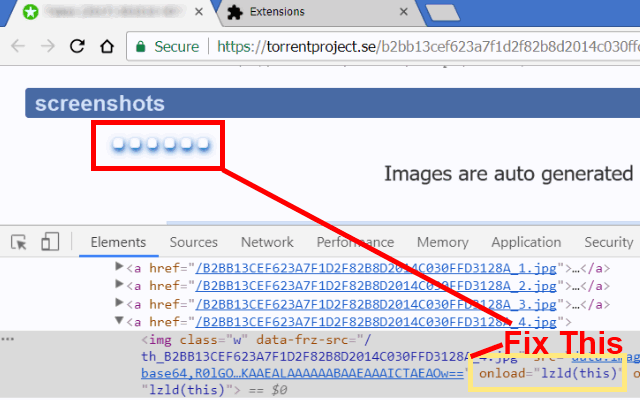
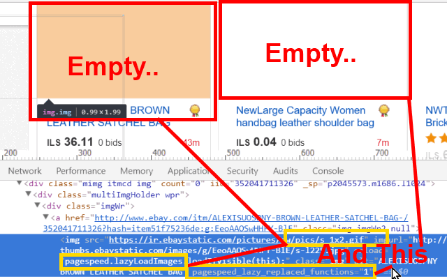

<h1> Chrome-Extension-UnLazy</h1>

<h2>★★★★★ Lazy-Loading Be-Gone!</h2>

Removes lazy-loading delay from everything that has it (mostly image and iframe elements have it),
You will get your content very fast, and your page will react faster to scroll and mouse movement/touch gestures.

Will Work Everywhere! (eBay, Amazon, WordPress, Blogger,...)

<pre>
Developer's HUB / Changelog

8.0.0.2
* including generalized alternative/custom pagespeed functionality used in ebay.

8.0.0.1
* reduced functionality - handling just pagespeed.

7.0.3.3
* improved handling of SPF loading. Note that YouTube will still cache the webp animated-video previews, if you want to block it (since you will use the jpg static preview anyway) you should add something like this "ytimg.com/*/mqdefault_6s.webp" rule to your ublock-origin list, which will load the page faster.

7.0.1.1
* handling all images on the page and improved results heuristically.
+ dynamic-pages element discovering - efficiently and w/o timers!
* including non-mainstream hacks for YouTube's static/moving thumbnail.

6.2.0.9
+ prefer to always show the video-preview on YouTube.

6.2.0.8
+ adding support for YouTube animated-video thumbs.

6.2.0.7
+ adding fixout for lazy-loading images, being hidden, mostly used in youtube...

6.2.0.6
+ added support for Chrome's idle state.
- reduce package size.
- limit re-discovery to once per-page life-cycle state-change (load/ready).
- removed isolation.

6.2.0.4
* improve element-discovery.
+ adding "hiding"-removal.

6.2.0.3
* improve element-discovery-query for hidden or ad-blocked images.

6.2.0.1
* refactor code for global scope isolation (reduced memory print).
* refactor code for image background pre-caching outside of DOM (reduced reflow, reduced CPU).
* generic code-style refactor, to be slightly-less-centralised (reduce usage of anonymous-function in main loop since those are now cached-once and referenced onced in-look by name).
* specified ONLY handling of IMG elements - ignore IFRAMEs, although possible to being handled by this extension :../  ...and ignore SCRIPTs since it was never-meant to be handled by this extension :/

6.1.4.2
* improved element discovery (ignoring 'srcset' - which is a legitimate HTML5's attribute and not "lazy" related..)

6.1.4.1
+ add support for LazyLoading using generic 'js-preload'.

6.1.3.1
+ added generic heuristics-pattern matching for jQuery's LazyLoad.

6.1.2.7
+ added anti-YouTube-LazyLoading.

6.1.2.5
* refactor flag identification.

6.1.2.4
* improved flag definition.

6.1.2.3
+ added fix for unescaped-HTML-entities leftovers.

6.1.2.2
+ initial (mostly used in Google's PageSpeed LazyLoading - for example: used on eBay)
</pre>

<!--  -->