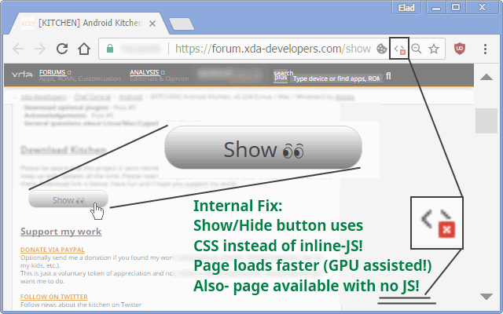

<h1> Chrome-Extension-XDA</h1>

Visual Tweaks For XDA-Developers' Forums.

<h3>This Extension Is A Great Work Enhancer!</h3>

<pre>
Developer's HUB / Changelog

3.0.2.1
* improved background counter efficiency.

3.0.1.9
+ added support for Chrome's idle state.
- reduce package size.
- limit re-discovery to once per-page life-cycle state-change (load/ready).
* 100% offline.

3.0.1.8
* fix engine-loading.

3.0.1.7
+ error handling

3.0.1.6
* flag fix

3.0.1.5
* limit repetition by flag done-elements.

3.0.1.3
+ error handling

3.0.1.2
* adding prototyping for browser compatibility.

3.0.1.1
* tag-number updated instead of overriding it.

3.0.0.1
* engine update.

2.0.0.5
+ initial (no versioning while internal-dev. cycle..)
</pre>

<!--  -->