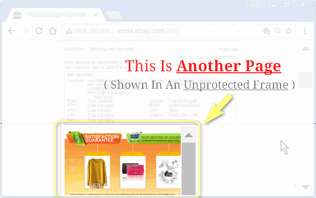
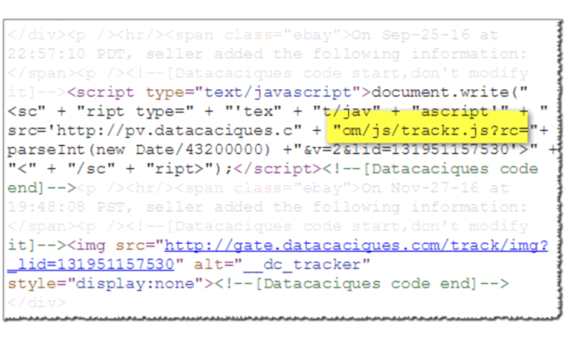
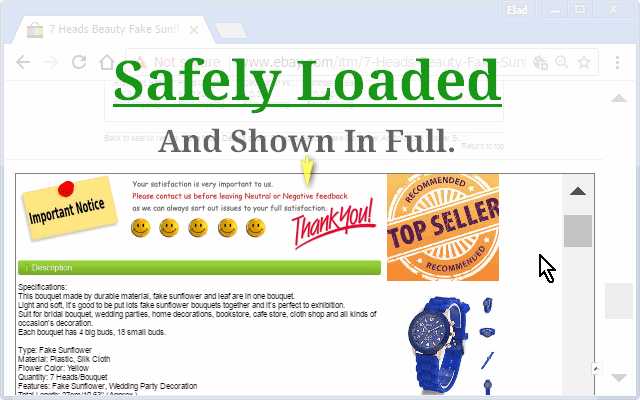
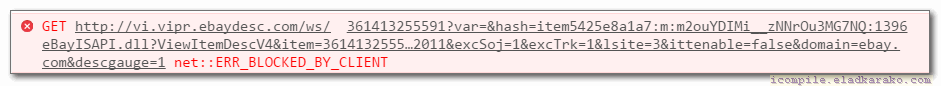

<h1> Chrome-Extension-eBay-Boxed</h1>

<h2>Prevent eBay From Leaking Your-Details To China-Vendors!</h2>

- Play safe in eBay.
- Prevent items-pages from loading malicious code from China-vendors.
- Prevent China-vendors from tracking your IP and storing malicious forever-cookies to track your identity.

Developers can read the technical description of "what is a sandbox-iframe",
and how it is so much better to load questionable-content within it, providing much needed protection for clients,
by reading the following articles:
- [Play safely in sandboxed IFrames - html5rocks.com](https://www.html5rocks.com/en/tutorials/security/sandboxed-iframes/)
- [IFrame element - developer.mozilla.org](https://developer.mozilla.org/en-US/docs/Web/HTML/Element/iframe)

The <code>eBay-Boxed</code> chrome-extension is 100% free (as beer!), includes NO ADS and NO TRACKING (I hate those!!!) and is completely open-source.
You can view the project at https://github.com/eladkarako/Chrome-Extension-eBay-Boxed/
Or even report a bug or suggest an improvement at https://github.com/eladkarako/Chrome-Extension-eBay-Boxed/issues/

I make absolutly no profit out of this other than satisfaction of a job well done :]

<pre>
Developer's HUB / Changelog

1.0.2.2
+ added support for Chrome's idle state.
- reduce package size.
- limit re-discovery to once per-page life-cycle state-change (load/ready).

1.0.2.1
* only apply fix for iframe, leave other web-parts (junk..) untouched.

1.0.1.2
* engine speed boost.

1.0.0.5
* error handling.

1.0.0.4
* engine updated - force iframe content-type to text/html with UTF-8 charset.

1.0.0.2
* engine updated (permissions)

1.0.0.1
+ initial.
</pre>

What does this "error" means?

<h2>This Is A Good Thing!</h2>
What you see is the first, unprotected request, being blocked from opened in an unprotected IFRAME,
eBay-Boxed will create a sandboxed iframe at the bottom of the page, loading it,
with the addition of <code>sandboxed=true</code> at the end of the original request, to flag the extension-side,
that "this is ok to load".

It will also load your page faster,
Since all of the China-scripts and analytics-codes from inside the frame will be blocked, having your browser avoid downloading all this junk!

You can read more on my tech. blog, which has the original code,
it was lacking the blocking of the initial request though since before it was just meant for improving visibility by allowing the description frame to be opened- bigger/wider at the bottom of the page :)
[iCompile-  JavaScript Ninja – eBay Page Fix – Cleanup And Main Description](http://icompile.eladkarako.com/ebay-page-fix/)

Happy days!

<!--  -->